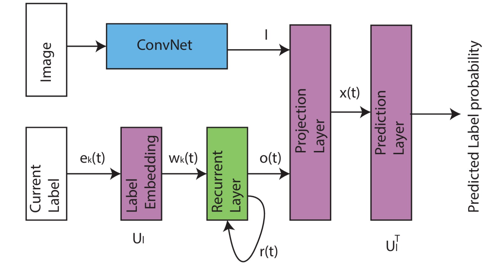

# CNN-RNN: Multi-Label Image Classification

**Live Demo:** [Try the Live Model Here](https://avinashsappati-cnnrnn-multi-label-classification.hf.space/)

A full-stack Deep Learning application that detects multiple objects in a single image using a hybrid **CNN-RNN architecture**. This repository bridges the gap between complex machine learning architecture ([based on Wang et al., CVPR 2016](https://arxiv.org/pdf/1604.04573) and a clean, user-facing web interface.

## Team Members 
* **Avinash Sappati** | Roll No: 24AI10001
* **Rohit Mehtre**    | Roll No:24AI10045
* **Hansini Arangi**  | Roll No: 24AI10018
* **Chunarkar Sujeeth Kumar** | Roll No: 24AI10021
* **Mohammad Nisar** | Roll No: 24AI10038
---

## Dataset & Preprocessing

### The Dataset: [PASCAL VOC 2007](https://www.kaggle.com/datasets/zaraks/pascal-voc-2007)
The model is trained and evaluated on the **PASCAL Visual Object Classes (VOC) 2007** dataset, a benchmark in visual object category recognition.
* **Total Images:** 9,963 (Train/Val/Test splits)
* **Classes:** 20 distinct object categories.
* **Categories Include:** * *Vehicles:* Aeroplane, Bicycle, Boat, Bus, Car, Motorbike, Train
  * *Household:* Bottle, Chair, Dining Table, Potted Plant, Sofa, TV/Monitor
  * *Animals/People:* Bird, Cat, Cow, Dog, Horse, Sheep, Person
* **Challenge:** Images frequently contain multiple overlapping classes (e.g., a person riding a horse next to a dog), requiring the model to understand complex semantic context.

### Preprocessing Steps
To prepare the visual and sequential data for the hybrid architecture, the following preprocessing pipeline is applied:
1. **Image Standardization:** Images are resized to 224x224 pixels and normalized using standard ImageNet mean and standard deviation values to align with the pre-trained VGG-16 backbone.
2. **Data Augmentation:** During training, random horizontal flips and color jittering are applied to prevent overfitting and force the model to learn structural shapes rather than memorizing pixels.
3. **Target Generation:** Two targets are generated per image:
   * A standard multi-hot binary vector for evaluating end-of-pipeline metrics (mAP).
   * A frequency-sorted sequence of labels (e.g., `<START>`, `Person`, `Dog`, `<END>`). Sorting by frequency ensures the LSTM learns to predict the most prominent objects first, providing structured sequential data for the recurrent network.
4. **Dynamic Batching:** A custom `collate_fn` is utilized to pad variable-length label sequences with `<PAD>` tokens dynamically during the training loop, ensuring efficient matrix operations without breaking the DataLoader.

---

## Architecture Breakdown: Joint CNN-LSTM

  

The system relies on a dual-pathway architecture to capture both spatial features and sequential label dependencies, merging them into a joint embedding space.

**Framework Pipeline**
1. **Vision Encoder:** `Input Image` ➔ `VGG-16 CNN` ➔ `Image Feat. I`
2. **Sequence Decoder:** `Prev Label e_k` ➔ `Emb w_k` ➔ `LSTM Cell` ➔ `Hidden o(t)`
3. **Joint Fusion:** `x_t = h(U^{xo} \cdot o(t) + U^{xI} \cdot I)` ➔ `Score s(t) = U_l^T x_t` ➔ `Softmax`

### Key Dimensions & Notation
* **Image Feat $I$:** 4096-d *(Extracted from VGG-16 fc7 layer)*
* **Label Emb $w_k$:** 64-d
* **LSTM state $r(t)$:** 512-d
* **LSTM out $o(t)$:** 512-d
* **Joint Emb $x_t$:** 512-d
* **Label Set $L$:** Total dataset vocabulary size
* $\delta$ denotes the ReLU activation function.
* $\odot$ denotes element-wise product.

---

## The Mathematical Formulation

Standard multi-label classification assumes object independence. This architecture fundamentally rejects that assumption, modeling image classification as a joint probability distribution where the presence of one object directly influences the probability of another.

### 1. Joint Image-Label Embedding
Both the image and the text labels are projected into a shared latent space. The probability of detecting object $y_t$ relies on the global image features and the history of previously detected objects:

* **Label embedding:** $w_k = U_l \cdot e_k$
* **Joint embedding:** $x_t = h(U^{xo} \cdot o(t) + U^{xI} \cdot I)$
* **Label scores:** $s(t) = U_l^T \cdot x_t$
* **Probability:** $p(y_t | y_{<t}, I) = \text{softmax}(s(t))$

### 2. LSTM State Transitions (per step $t$)
At each time step $t$, the LSTM maintains a hidden state $r(t)$ that acts as structural memory. The internal gates update based on the previously emitted label and the previous state:

* **Input terms:** $x_t' = \delta(U_r r(t-1) + U_w w_k(t))$
* **Input gate:** $i_t = \delta(U_{ir} r(t-1) + U_{iw} w_k(t))$
* **Forget gate:** $f_t = \delta(U_{fr} r(t-1) + U_{fw} w_k(t))$
* **Output gate:** $o_t' = \delta(U_{or} r(t-1) + U_{ow} w_k(t))$
* **Hidden state:** $r(t) = f_t \odot r(t-1) + i_t \odot x_t'$
* **Output vector:** $o(t) = r(t) \odot o_t'$

## Experimental Results

The model's performance was evaluated against the testing split using Mean Average Precision (mAP), the gold standard metric for multi-label classification. 

* **Overall Benchmark:** 65.23% mAP.

| Category | Average Precision (AP) | Notes |
| :--- | :--- | :--- |
| **Aeroplane** | 95.3% | Highly correlated with the original CVPR paper results. |
| **Person** | 92.6% | Exceptional detection rate for the most frequent class in the dataset. |
| **Overall mAP** | **65.23%** | Demonstrates strong contextual learning across all 20 classes. |

*(Note: See the `results/` folder for visual benchmark comparisons and training loss curves).*

---

## Repository Structure

    DL-Course-Project/
    │
    ├── backend/                  # PyTorch Model & FastAPI Server
    │   ├── app.py                # Main API routing and CORS configuration
    │   ├── inference.py          # Image transformation and batch prediction logic
    │   ├── model.py              # CNN-RNN architecture classes
    │   ├── requirements.txt      # Python dependencies
    │   └── weights/              
    │       └── finalmodel.pth  # Downloaded from GitHub Releases
    │
    ├── frontend/                 # UI Interface
    │   ├── index.html           
    │   ├── script.js             # API integration and DOM manipulation
    │   └── style.css             
    │
    ├── results/                  # Benchmark comparisons and charts
    │   ├── comparison_benchmark.png
    │   └── paper_vs_implementation.csv
    │
    └── Dockerfile 
    |
    └── README.md                 

---

## Setup & Execution Instructions

### 1. Model Weights Setup
Due to file size limits, the 500MB+ model weights are hosted in the **Releases** section of this repository.
1. Go to the **Releases** tab.
2. Download `finalmodel.pth`.
3. Place the file inside the `backend/weights/` directory.

### 2. Backend Execution (Local)
Open a terminal, navigate to the `backend` folder, and install the required dependencies:

    cd backend
    pip install -r requirements.txt

Start the FastAPI server:

    uvicorn app:app --reload

*The API is now active at `http://127.0.0.1:8000`.*

### 3. Frontend Execution (Local)
Open a **new** terminal, navigate to the `frontend` folder, and start a local web server:

    cd frontend
    python -m http.server 3000

*Navigate your browser to `http://localhost:3000` to interact with the batch-processing UI.*

### 4. Cloud Deployment (Hugging Face)
This repository is configured for immediate deployment via Docker on Hugging Face Spaces. The included `Dockerfile` automatically pulls the large model weights from GitHub Releases during the build phase, bypassing standard git LFS limitations.

---

## Tech Stack
- **Deep Learning:** PyTorch, Torchvision
- **Backend API:** FastAPI, Uvicorn, Python-Multipart,Docker,Hugging Face
- **Frontend UI:** HTML5, CSS3, Vanilla JavaScript
- **Data Processing:** PIL, NumPy, Pandas, Matplotlib
